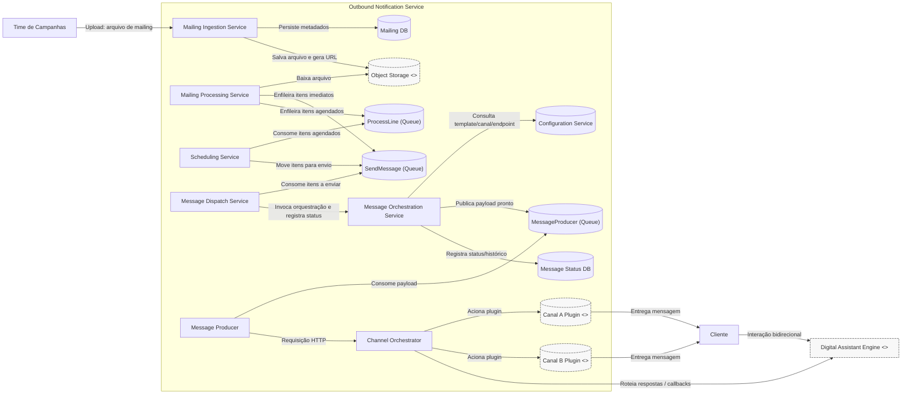

# Arquitetura v1 — Diagrama C4 (Containers) em Mermaid

Observações:
- Componentes externos são marcados como `<<external>>`.
- O diagrama segue o nível C4 — Containers (não mostra classes, endpoints ou payloads).
- Ajuste rótulos e posicionamento conforme preferir antes de revisar no GitHub.
