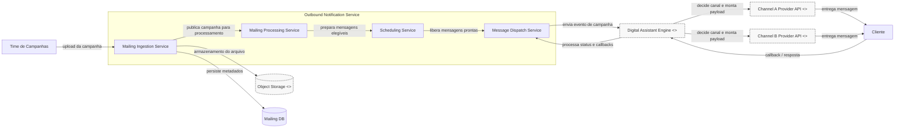

```mermaid
flowchart LR
  CAM["Time de Campanhas"]
  CUST["Cliente"]
  OBJ[("Object Storage <<external>>")]
  MDB[("Mailing DB")]
  DA["Digital Assistant Engine <<external>>"]
  CHPA["Channel A Provider API <<external>>"]
  CHPB["Channel B Provider API <<external>>"]

  subgraph PUSH["Outbound Notification Service"]
    direction TB
    MI["Mailing Ingestion Service"]
    MP["Mailing Processing Service"]
    SCHED["Scheduling Service"]
    DISP["Message Dispatch Service"]
  end

  CAM -->|"upload da campanha"| MI
  MI -->|"persiste metadados"| MDB
  MI -->|"armazenamento do arquivo"| OBJ
  MI -->|"publica campanha para processamento"| MP
  MP -->|"prepara mensagens elegíveis"| SCHED
  SCHED -->|"libera mensagens prontas"| DISP

  DISP -->|"envia evento de campanha"| DA

  DA -->|"decide canal e monta payload"| CHPA
  DA -->|"decide canal e monta payload"| CHPB
  CHPA -->|"entrega mensagem"| CUST
  CHPB -->|"entrega mensagem"| CUST

  CUST -->|"callback / resposta"| DA
  DA -->|"processa status e callbacks"| DISP

  classDef external fill:#f8f8f8,stroke:#333,stroke-dasharray: 5 2
  class OBJ,DA,CHPA,CHPB external
```

