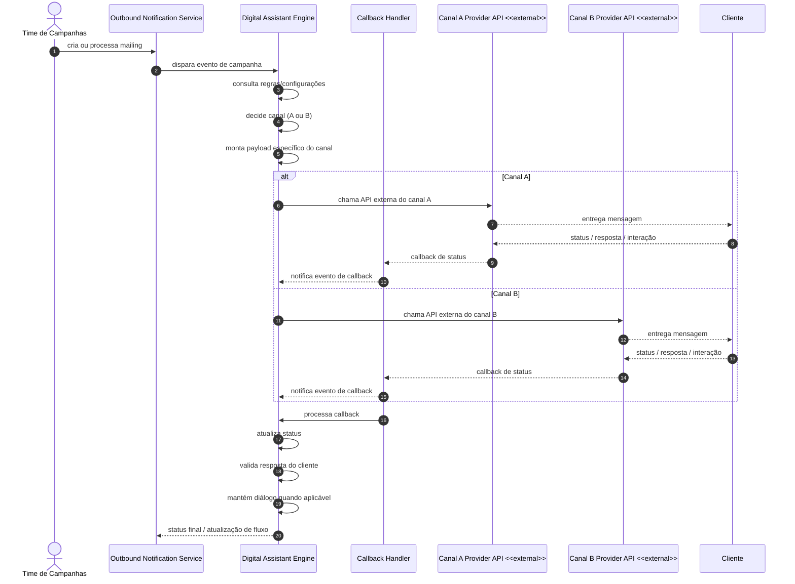

```mermaid
sequenceDiagram
    autonumber
    actor CAM as Time de Campanhas
    participant PUSH as Outbound Notification Service
    participant BOT as Digital Assistant Engine
    participant CH as Callback Handler
    participant CA as Canal A Provider API <<external>>
    participant CB as Canal B Provider API <<external>>
    participant CUST as Cliente

    CAM->>PUSH: cria ou processa mailing
    PUSH->>BOT: dispara evento de campanha

    BOT->>BOT: consulta regras/configurações
    BOT->>BOT: decide canal (A ou B)
    BOT->>BOT: monta payload específico do canal

    alt Canal A
        BOT->>CA: chama API externa do canal A
        CA-->>CUST: entrega mensagem
        CUST-->>CA: status / resposta / interação
        CA-->>CH: callback de status
        CH-->>BOT: notifica evento de callback
    else Canal B
        BOT->>CB: chama API externa do canal B
        CB-->>CUST: entrega mensagem
        CUST-->>CB: status / resposta / interação
        CB-->>CH: callback de status
        CH-->>BOT: notifica evento de callback
    end

    CH->>BOT: processa callback
    BOT->>BOT: atualiza status
    BOT->>BOT: valida resposta do cliente
    BOT->>BOT: mantém diálogo quando aplicável

    BOT-->>PUSH: status final / atualização de fluxo
```