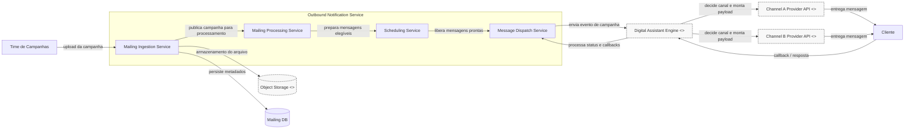

# Diagrama de Fluxo de Disparo de Mensagens

Versão: 1.1 — Atualização do diagrama C4 para o fluxo real do sistema de outbound notification.

## Visão geral

Este repositório reúne artefatos de arquitetura para documentar o fluxo de campanhas de mensagens, incluindo o diagrama C4 em Mermaid e os prompts utilizados para revisão e refinamento do modelo. A intenção é manter uma visão clara da responsabilidade de cada container, das integrações externas e do papel do Digital Assistant Engine no processo de decisão de canal e processamento de respostas.

## Roteiro revisado

- Escopo: fluxo de campanhas do Outbound Notification Service até a entrega por canais externos.
- Nível: C4 — Containers, sem mostrar classes, endpoints, payloads ou detalhes internos de implementação.
- Limites e responsabilidades: o Push realiza ingestão, processamento e agendamento; o Bot decide o canal, monta o payload e chama as APIs externas.
- Integrações externas: object storage, Digital Assistant Engine e APIs dos provedores de canal.
- Restrições: o Push não decide canal, não chama APIs externas e não processa callbacks.
- Lacunas do modelo anterior: canal definido no lugar errado, bot ausente no fluxo principal, callbacks incompletos e responsabilidades misturadas.
- O Digital Assistant Engine é o ponto central da decisão do canal e do processamento de respostas.
- O Message Dispatch Service dispara eventos para o Bot, que executa a entrega específica por canal.
- O cliente recebe a mensagem pelo canal escolhido e retorna interações para o Bot.
- O diagrama prioriza dependências relevantes e evita detalhes operacionais de implementação.

## Diagrama C4 (Containers) renderizado

## Decisões e Ajustes

- O Push foi mantido como camada de ingestão, processamento e agendamento, sem responsabilidade de canal.
- O Digital Assistant Engine foi posicionado como ponto de decisão central do fluxo.
- As integrações com provedores de canal foram tratadas como APIs externas independentes.
- O fluxo de callbacks foi explicitado para refletir interações bidirecionais com o cliente.
- O diagrama foi reduzido para dependências relevantes, sem misturar níveis de abstração.

## Lacunas e Próximos Passos

- Definir se o Digital Assistant Engine é uma solução interna ou um provedor externo/terceirizado.
- Confirmar se o produto possui apenas dois canais ou uma matriz maior de integrações.
- Validar se o callback do cliente retorna diretamente ao Bot ou passa por um gateway de eventos.
- Especificar como o status da mensagem é persistido ao longo do ciclo de envio.
- Explicar a responsabilidade exata do Message Dispatch Service em relação a retries e auditoria.

## Como este repositório serve de contexto para agentes de desenvolvimento

Este repositório funciona como uma base de contexto arquitetural para agentes de desenvolvimento e revisão de código. Ele documenta: o fluxo principal do sistema, a nomenclatura dos containers, as dependências relevantes, as decisões de design e os pontos que ainda precisam de confirmação. Dessa forma, agentes podem compreender melhor o escopo do problema antes de propor implementações, refatorações ou novos diagramas, reduzindo ambiguidades e preservando a coerência do modelo arquitetural.

## Estrutura do repositório

- [Prompts](Prompts): prompts utilizados para orientar geração e revisão dos diagramas.
- [Arquitetura](Arquitetura): arquivos diagramáticos e versões do modelo C4.
- [README.md](README.md): visão geral e contexto do projeto para revisão e manutenção.

## Observações finais

Este README foi organizado para ser claro, versionável e alinhado à Unidade III, preservando a rastreabilidade do desenho arquitetural e favorecendo a continuidade do trabalho entre revisão humana e agentes automáticos.
