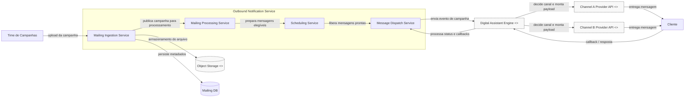

# Saída Prompt 1.1 — Atualização de Diagrama C4

## 1) Lacunas relevantes (7)

1. O diagrama atual coloca a decisão de canal no Outbound Notification Service, o que contraria o fluxo real do Bot.
2. O Push aparece fazendo chamadas diretas para canais externos, mas a regra do sistema exige que o Bot faça essas integrações.
3. O Bot não aparece como ponto central de decisão e processamento de respostas, apesar de ser o responsável pelo canal e pelos callbacks.
4. O modelo atual mistura responsabilidades de orquestração, envios e entrega, dificultando separação de domínios e rastreabilidade.
5. Os provedores de canal são tratados como plugins internos, quando o correto é representá-los como APIs externas ou providers externos.
6. O fluxo de callbacks e respostas do cliente não fica explícito, apesar de ser parte crítica da interação bidirecional.
7. O payload específico por canal e a montagem em tempo de decisão do Bot não aparecem como responsabilidade funcional do sistema.

## 2) Perguntas de esclarecimento (7)

1. O Digital Assistant Engine é um componente interno ou um sistema externo/terceirizado?
2. Há somente dois canais em uso, ou a solução pode evoluir para mais provedores?
3. O cliente pode interagir por múltiplos canais simultaneamente em uma mesma campanha?
4. O callback do cliente retorna diretamente para o Bot ou passa por um gateway/intermediário?
5. O Message Dispatch Service também é responsável por status, retries e auditoria, ou apenas dispara eventos?
6. O object storage é parte do mesmo domínio tecnológico ou uma integração externa de persistência?
7. O histórico de campanhas e status de entrega fica centralizado no Push, no Bot ou em ambos?

## 3) Roteiro revisado (10 linhas)

1. Escopo: fluxo de campanhas do Outbound Notification Service até a entrega em canais externos e o retorno de respostas ao Bot.
2. Nível: C4 — Containers; sem classes, endpoints, payloads ou componentes internos detalhados.
3. Limites e responsabilidades: Push realiza ingestão, processamento e agendamento; Bot decide canal, monta payload e invoca APIs externas.
4. Integrações externas: Object Storage, Digital Assistant Engine e provedores de canal.
5. Restrições: Push não decide canal, não chama APIs externas e não processa callbacks.
6. Lacunas do diagrama anterior: canal configurado no lugar errado, bot ausente no fluxo principal e callbacks incompletos.
7. O Digital Assistant Engine é o ponto central de decisão e processamento de respostas.
8. O Message Dispatch Service dispara eventos para o Bot, que executa a entrega específica por canal.
9. O cliente recebe a mensagem no canal definido e retorna interações para o Bot.
10. O diagrama prioriza dependências relevantes e evita detalhes operacionais de implementação.

## 4) Novo diagrama C4 Containers (Mermaid)

## 5) Checklist de revisão (10 itens)

1. O diagrama está em nível C4 — Containers.
2. O Push não decide canal.
3. O Push não chama APIs externas.
4. O Bot é o ponto central de decisão de canal.
5. O Bot monta o payload específico por canal.
6. O Bot invoca APIs distintas para cada provedor externo.
7. O cliente recebe a mensagem por meio do canal escolhido.
8. Callbacks e respostas retornam para o Bot.
9. Os provedores externos estão marcados como `<<external>>`.
10. O fluxo é consistente com a solução real do problema.

---

Este documento consolida a revisão do segundo prompt e o novo desenho do diagrama em Mermaid, mantendo o foco no fluxo correto da arquitetura C4.
