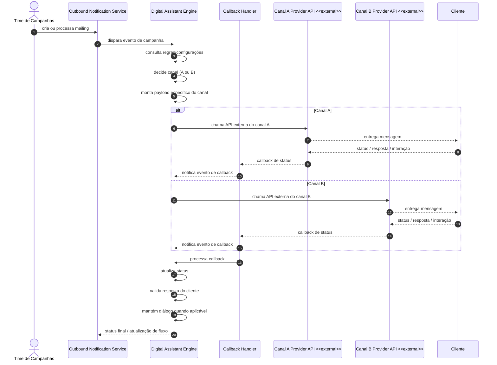

# Saída Prompt 2 — Geração de Diagrama de Sequência

## 1) Lacunas relevantes (10)

1. Não está claro como o Outbound Notification Service dispara o evento para o Bot: em fila, webhook ou chamada direta.
2. A regra de decisão de canal não foi definida formalmente: ela depende de regras, configuração, segmentação ou histórico do cliente?
3. Há ambiguidade sobre como o payload é montado para cada canal e se isso é responsabilidade exclusiva do Bot.
4. O canal pode falhar na entrega e como esse erro deve ser tratado não foi especificado.
5. O callback de status não está completamente definido em termos de semântica: entregue, falhou, lido ou respondido.
6. Não ficou claro se a resposta do cliente deve manter o mesmo canal ou abrir um diálogo em fluxo diferente.
7. A latência e a eventual consistência do callback não foram tratadas no desenho do fluxo.
8. O modelo não define como o sistema lida com retries em caso de falha de chamada ao canal.
9. A persistência do status da mensagem ao longo do ciclo de entrega e callback não foi explicitada.
10. A relação entre o Bot e o Callback Handler precisa ser melhor definida para evitar duplicação de responsabilidades.

## 2) Perguntas de esclarecimento (8)

1. O evento de disparo do Push para o Bot é síncrono ou assíncrono?
2. O Bot consulta regras e configurações em banco próprio ou em um serviço de configuração centralizado?
3. A decisão de canal é estática por campanha ou dinâmica por cliente, contexto ou tempo?
4. O payload específico do canal é montado no próprio Bot ou em um serviço auxiliar?
5. Cada provedora de canal tem contrato e retorno diferentes para sucesso ou falha?
6. O callback do canal pode chegar em retriadas ou em concorrência? Como isso é tratado?
7. Quando o cliente responde, o Bot reabre o diálogo na mesma conversa ou cria um novo fluxo?
8. O status é persistido no Bot, no Push ou em um serviço de observabilidade centralizado?

## 3) Roteiro revisado (10 linhas)

1. Escopo: jornada crítica de disparo, decisão de canal, entrega ao cliente e retorno de callback para o Bot.
2. Participantes: Time de Campanhas (opcional), Outbound Notification Service, Digital Assistant Engine, Canal A Provider API, Canal B Provider API, Cliente e Callback Handler.
3. Caminho principal: Push processa o mailing, dispara evento para o Bot, o Bot consulta regras/configuração, decide canal, monta payload e chama a API externa.
4. Entrega: o canal escolhido entrega a mensagem ao cliente e devolve confirmação ou status por callback.
5. Caminho alternativo: falha na chamada do canal ou falha de entrega implica tratamento de retry, log e atualização de status.
6. Decisão de canal: o Bot decide a rota com base em regras/configurações e não no Push.
7. Callback: o canal envia eventos assíncronos com status e resposta do cliente ao Bot.
8. O Callback Handler faz parte do Bot e processa eventos, atualiza status e mantém o diálogo quando aplicável.
9. O diagrama prioriza a temporalidade da interação e a ordem das chamadas, sem detalhar payloads.
10. O desenho evita misturar níveis estruturais e mostra apenas as interações comportamentais relevantes.

## 4) Diagrama de sequência completo (Mermaid)

## 5) Checklist de revisão (10 itens)

1. O diagrama é comportamental, não estrutural.
2. A ordem temporal das interações está visível.
3. Há decisão explícita do canal pelo Bot.
4. O Push não decide canal nem chama APIs externas.
5. O Bot monta o payload específico do canal escolhido.
6. O canal escolhido entrega a mensagem ao cliente.
7. O callback retorna ao Bot via Callback Handler.
8. O fluxo inclui falha/estado alternativo quando aplicável.
9. Os canais externos estão marcados como `<<external>>`.
10. O diagrama não mistura níveis nem detalhes de payload.

---

Este documento consolida a resposta do Prompt 2 e registra a jornada crítica de disparo, escolha de canal, entrega e retorno de callback em diagrama de sequência.
